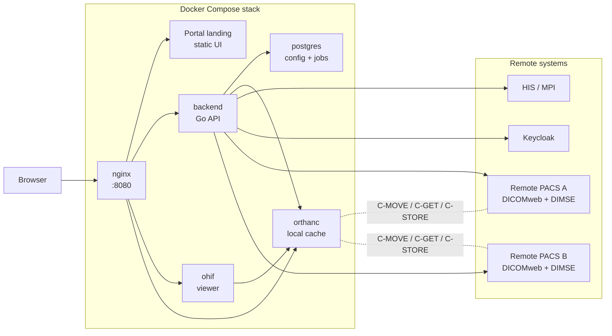

# Portal Spec-Driven Workflow

This folder is set up for a human-in-the-loop spec-driven development flow, so you can review and steer decisions before coding.

## What is in this folder

- `requirements.md`: the source requirements for the project.
- `decisions.md`: the human decision log. You edit this after reviewing agent output.
- `spec.py`: the workflow runner.
- `requirements-dev.txt`: Python dependencies for the workflow.
- `artifacts/`: generated outputs from each step.
- `app/`: the runnable implementation workspace for Docker, backend, Nginx, Orthanc, OHIF, and config files.

## Document index

### Core project docs

- [README.md](README.md)
- [AGENTS.md](AGENTS.md)
- [requirements.md](requirements.md)
- [decisions.md](decisions.md)
- [IMPLEMENTATION_CHECKLIST.md](IMPLEMENTATION_CHECKLIST.md)

### Generated and maintained artifacts

- [artifacts/01_technical_spec.md](artifacts/01_technical_spec.md)
- [artifacts/02_agent_debate.md](artifacts/02_agent_debate.md)
- [artifacts/03_implementation_plan.md](artifacts/03_implementation_plan.md)
- [artifacts/04_qa_checklist.md](artifacts/04_qa_checklist.md)
- [artifacts/05_ui_contracts.md](artifacts/05_ui_contracts.md)
- [artifacts/06_data_model.md](artifacts/06_data_model.md)

## Runtime topology



## Step 1: create and activate the virtual environment

From the repository root:

```bash
cd /Users/psilveira/src/salud/pacs/portal2
python3 -m venv .venv
source .venv/bin/activate
```

If the environment is already created, only run:

```bash
cd /Users/psilveira/src/salud/pacs/portal2
source .venv/bin/activate
```

## Step 2: install dependencies

```bash
pip install --upgrade pip
pip install -r requirements-dev.txt
```

## Step 3: configure API access

Create your local env file:

```bash
cp .env.example .env
```

Then edit `.env` and set a valid `OPENAI_API_KEY`.

Optional settings:

- `OPENAI_MODEL`: defaults to `gpt-5.2`
- `OPENAI_TEMPERATURE`: defaults to `0`

## Step 4: confirm the requirements baseline

Edit `requirements.md` first. This file is the contract for the workflow.

Recommended rule:

- only change `requirements.md` when the product scope changes
- only change `decisions.md` when you are resolving open design questions

Current baseline for the first MVP:

- no user authentication yet
- Docker Compose first
- Orthanc local cache first
- backend + PostgreSQL + Nginx + OHIF in the initial stack
- HIS and remote dcm4chee details will be injected later as configuration

## Step 5: run the workflow one step at a time

Run the steps in order:

```bash
python spec.py architect
python spec.py debate
python spec.py plan
python spec.py qa
```

Or run everything in one pass:

```bash
python spec.py run
```

Generated files will appear under `artifacts/`:

- `artifacts/01_technical_spec.md`
- `artifacts/02_agent_debate.md`
- `artifacts/03_implementation_plan.md`
- `artifacts/04_qa_checklist.md`

## How to participate in the decisions between agents

The intended loop is not fully automatic. You are supposed to intervene between steps.

### Recommended review loop

1. Run `python spec.py architect`.
2. Read `artifacts/01_technical_spec.md`.
3. If the spec made a wrong assumption, update `requirements.md` or write a correction in `decisions.md`.
4. Run `python spec.py debate`.
5. Read `artifacts/02_agent_debate.md`.
6. Copy the decisions you agree with into `decisions.md`.
7. Mark rejected proposals explicitly in `decisions.md` so the next step does not repeat them.
8. Run `python spec.py plan`.
9. Read `artifacts/03_implementation_plan.md` and confirm the first build slice is acceptable.
10. Run `python spec.py qa` before coding starts.

For the current MVP, the first questions the agents should help settle are:

1. Whether PostgreSQL is the right persistence layer for the MVP.
2. Which config format to use for HIS and remote dcm4chee nodes.
3. Whether retrieve should be only manual in MVP, or manual plus background jobs.
4. How Nginx should expose OHIF, backend API, and static assets.

### What to write in `decisions.md`

Good entries are short and explicit. Example:

```md
## Status
- In progress

## Decisions
- Auth model: patients use DNI + código por mail.
- Doctor access: full manual search is allowed only for authenticated staff users.
- Local cache: Orthanc is mandatory, retention 7 days.
- OHIF access: only through portal-controlled session, JWT restriction deferred to iteration 2.

## Rejected Options
- No patient password login.
- No public share links in v1.
```

### How the agents use your input

Each step reads:

- `requirements.md` as the source of truth for scope
- `decisions.md` as the source of truth for resolved choices

That means your participation is simple:

- update `requirements.md` when the product itself changes
- update `decisions.md` when you want to steer the design discussion

## Suggested operating discipline

Use this order whenever the project changes:

1. Update `requirements.md`.
2. Delete old files under `artifacts/` if they no longer reflect the new scope.
3. Run `python spec.py architect`.
4. Review and decide in `decisions.md`.
5. Continue with `debate`, `plan`, and `qa`.
6. Only start implementation after the QA checklist has no important `Needs Decision` items.

## Common commands

Activate venv:

```bash
source .venv/bin/activate
```

Create the environment and install dependencies:

```bash
make setup
```

Run a single step:

```bash
python spec.py debate
```

Run the full flow:

```bash
python spec.py run
```

Run the same flow with shortcuts:

```bash
make architect
make debate
make plan
make qa
make run
```

## Next recommended step

After setup, run:

```bash
source .venv/bin/activate
python spec.py architect
```

Then review `artifacts/01_technical_spec.md` and record your first decisions in `decisions.md`.
